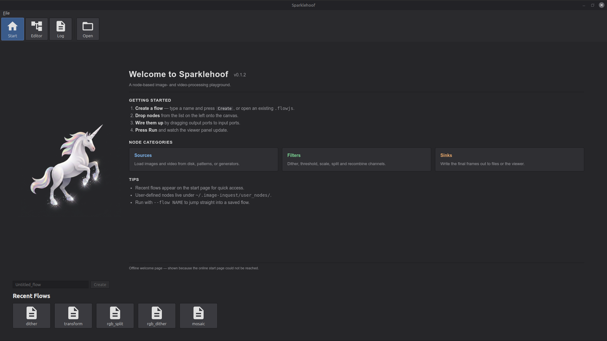
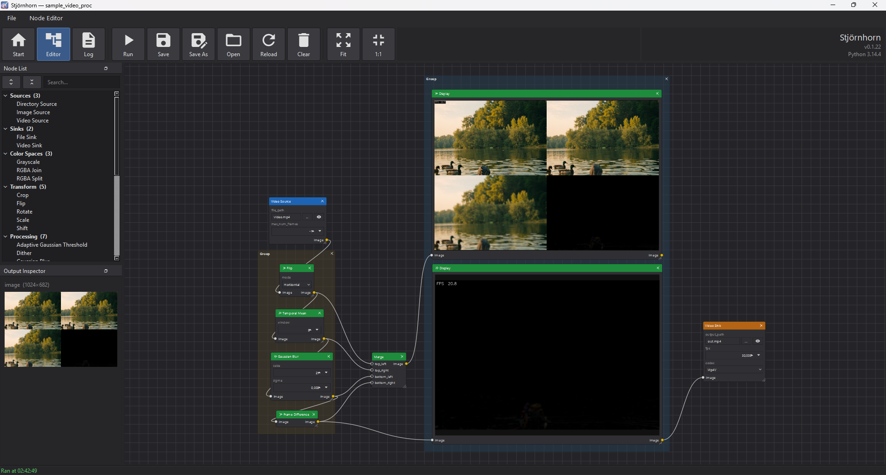

<p align="center">
  
</p>

# Sparklehoof

This is a vibe coding experiment. It is based on an image processing pipeline that
was have written for illustrating articles on my web page beltoforion.de

A Python desktop application for building image- and video-processing
workflows using a node-based visual editor. Drop image sources,
filters, and sinks onto a canvas, wire them up, hit **Run**, then tweak
parameters and watch the output update live in the built-in viewer.

Typical uses:

- Experiment with image processing operations (dithering, thresholding,
  normalisation, scaling, channel splitting/joining, …) without writing
  code.
- Compose filters into reusable flows and save them to disk.
- Batch-convert and composite images by wiring up file sources and
  sinks.

## Installation

Prerequisites: **Python 3.10** or newer.

```bash
pip install -r requirements.txt
```

## Running

```bash
python src/main.py
```

Optional command-line arguments:

| Argument | Description |
|---|---|
| `--no-splash` | Skip the startup splash screen |
| `--flow FILE` | Open the named flow directly in the editor. Accepts a full path to a `.flowjs` file or a bare flow name (looked up in `flow/`). |

## Usage

### Start page

<p align="center">
  
</p>

The start page is the landing screen when the app opens. It is the
launch pad for working with flows — you either create a new one or pick
up where you left off with an existing one.

Options:

- **Name input** — type a name for a new flow. Names may contain
  ASCII letters, digits, and the characters `_ # + -`. The input also
  sets the filename stem that **Save** will use later (e.g. the name
  `dither_lab` saves to `flow/dither_lab.flowjs`).
- **Create** — opens the node editor with a fresh empty flow whose
  name matches the input. Disabled until the input contains a valid
  name; pressing <kbd>Enter</kbd> in the input triggers it.
- **Open** (toolbar, top) — launches a file dialog to load any
  `.flowjs` file from disk. The dialog starts in the app's `flow/`
  directory but you can browse anywhere.
- **Recent Flows** — a grid of tiles for flows you have recently
  created, opened, or saved. Click a tile to open that flow in the
  editor. Each tile shows the flow's name; hovering reveals the full
  path. The grid reads "No recent flows" until you have used one.

### Node editor

<p align="center">
  
</p>

The node editor is where flows are built and run. A flow is a graph
of nodes — sources produce images, filters transform them, sinks
consume them — connected by typed ports. The editor gives you a
palette, a canvas to wire nodes together, an output preview, and a
toolbar to drive the flow.

**Layout**

- **Node List** (dockable, left) — the palette of every registered
  node, grouped by section (Sources, Sinks, Color Spaces, Transform,
  Processing, Composit, …). A search box at the top filters the list
  live. Drag an entry onto the canvas to instantiate it. Toggle the
  dock via the **View** menu; it can be floated, re-docked, or closed.
- **Canvas** (centre) — the flow graph. Each node shows its title,
  input ports on the left, output ports on the right, and editable
  parameters in the body. A small × in the top-right of a node
  deletes it. Scroll to zoom; middle-mouse-drag to pan. Dropping a
  node from the palette places it at the cursor.
- **Output Inspector** (dockable, below the Node List) — previews the
  current output of whichever node is selected. Float it for a larger
  view; once floating, press <kbd>F11</kbd> to toggle full-screen
  preview.
- **Status bar** (bottom) — shows the last successful / informational
  message, such as "Ran at 14:23:55" or "Saved to flow/x.flowjs".
  Errors pop up in a floating red banner at the top right instead,
  so long multi-line messages stay readable.

**Connecting nodes**

- Drag from an output port (right side of a node) to an input port
  (left side of another). The connection is only accepted if the
  port types are compatible — e.g. an `IMAGE_GREY` output may feed an
  input that accepts greyscale.
- Drag an existing link off either end to remove it.
- One output can drive many inputs; each input accepts exactly one
  upstream.

**Toolbar — Flow section**

- **Run** — execute the flow once. Sources push data through the
  graph to the sinks. Status bar updates with the run time; any
  exception shows up in the error banner.
- **Save** — write the current flow to `flow/<name>.flowjs`, where
  `<name>` is the flow's current name.
- **Save As…** — write the current flow to a path you choose. The
  stem of the chosen filename becomes the flow's new name (which is
  then used by future **Save** clicks).
- **Open** — load another `.flowjs` file, replacing the current
  flow.
- **Clear** — remove every node and connection from the canvas.
  Asks for confirmation.

**Toolbar — View section**

- **Fit** — zoom and scroll so the whole graph fits the viewport.
- **1:1** — reset the view transform to 100 % zoom.
- **V-Stack** — align two or more selected nodes on a shared X axis
  and stack them top-to-bottom (preserves their current vertical
  order). Disabled until ≥2 nodes are selected.
- **H-Stack** — align two or more selected nodes on a shared Y axis
  and arrange them left-to-right (preserves their current horizontal
  order). Disabled until ≥2 nodes are selected.

**Live preview**

Flows that contain a still-image source are **reactive**: the editor
re-runs the flow automatically about 300 ms after the last parameter
change, so tweaks to a filter show up immediately in the Output
Inspector. Video sources and other non-reactive sources are only
executed when you press **Run** — parameter edits do not trigger a
full decode on every keystroke.

## Built-in nodes

Nodes are grouped into palette sections. Each name below matches the
label the node carries in the **Node List**.

### Sources

- **Image Source** — reads a single still image (JPEG, PNG, CR2 RAW)
  from disk and pushes it into the flow. Reactive: editing any
  parameter re-runs the flow automatically.
- **Video Source** — decodes frames from a video file (MP4, AVI, MOV,
  MKV) and pushes them through the graph. Not reactive — triggered
  only by **Run** — and a `max_num_frames` parameter caps how many
  frames are decoded.

### Sinks

- **File Sink** — writes the incoming frame to disk at a configurable
  path. Paths under the app's output folder are stored relative to it
  so saved flows stay portable. An eye button next to the path opens
  the written file in the OS default image viewer.

### Color Spaces

- **Grayscale** — converts a BGR colour image to a single-channel
  greyscale image (`cv2.cvtColor(..., COLOR_BGR2GRAY)`).
- **RGB Split** — splits a BGR image into three single-channel
  outputs named **B**, **G**, and **R**.
- **RGB Join** — merges three single-channel inputs (**B**, **G**,
  **R**) back into one BGR image.

### Transform

- **Scale** — resizes an image by a percentage factor
  (`scale_percent`, 100 = no change). Interpolation is selectable
  (Nearest, Linear, Cubic, Area, Lanczos4).
- **Shift** — translates an image by integer pixel offsets
  (`offset_x`, `offset_y`). Output keeps the original canvas size;
  pixels that move off-frame are dropped and newly exposed areas are
  black.

### Processing

- **Adaptive Gaussian Threshold** — adaptive binary thresholding
  using a Gaussian-weighted local mean (`cv2.adaptiveThreshold`).
  `block_size` sets the neighbourhood (odd, > 1); `c` is a constant
  subtracted from the weighted mean. Always emits a greyscale binary
  image.
- **Dither** — reduces the image to two levels (black and white)
  using a selectable dithering algorithm: Bayer (2 / 4 / 8), random
  noise, Floyd–Steinberg, Stucki, Atkinson, Burkes, Sierra,
  Diffusion-X, or Diffusion-XY. The error-diffusion kernels are
  JIT-compiled via numba for interactive speed. Colour inputs are
  auto-converted to grey; output is always greyscale.
- **Median** — square-kernel median blur
  (`cv2.medianBlur`). `size` must be odd and ≥ 1. Works on colour or
  greyscale input and keeps the input type.
- **Normalize** — histogram equalisation
  (`cv2.equalizeHist`). Colour inputs are equalised per channel;
  greyscale inputs are equalised directly. Output type matches input.

### Composit

- **Merge** — pastes up to four images into a 2×2 grid with inputs
  `top_left`, `top_right`, `bottom_left`, `bottom_right`. Unconnected
  quadrants are black; cell sizes are taken per row / per column so
  mismatched inputs don't distort; mixed colour / greyscale inputs
  are promoted to colour so nothing is lost.

## License

MIT — see [LICENSE](LICENSE).
