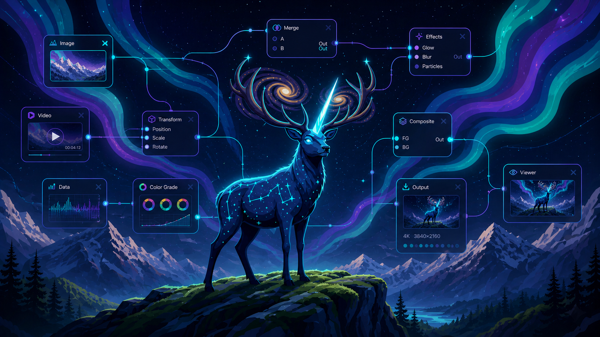
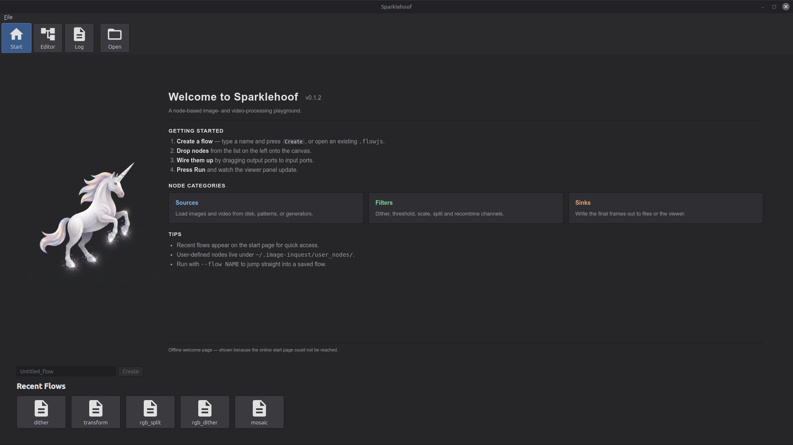
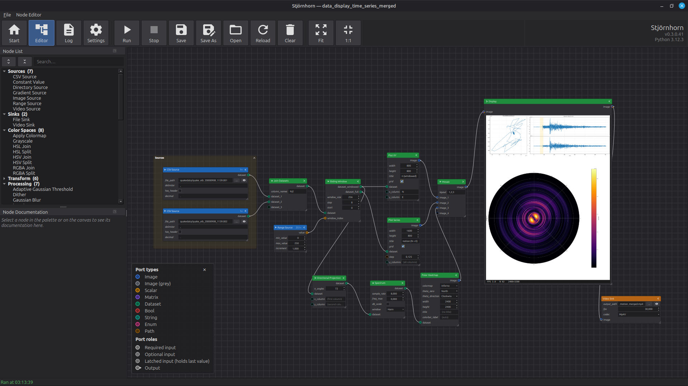

<p align="center">
  
</p>

[](https://github.com/beltoforion/stjornhorn/releases/tag/0.2.16)
# Stjörnhorn

A desktop application for building image- and video-processing
workflows using a node-based visual editor. Drop image sources,
filters, and sinks onto a canvas, wire them up, hit **Run**, then tweak
parameters and watch the output update live via inline `Display`
nodes wired into the flow.

Typical uses:

- Experiment with image processing operations (dithering, thresholding,
  normalisation, scaling, channel splitting/joining, …) without writing
  code.
- Compose filters into reusable flows and save them to disk.
- Batch-convert and composite images by wiring up file sources and
  sinks.

## Installation

Prerequisites: **Python 3.10** or newer.

```bash
pip install -r requirements.txt
```

## Running

```bash
python src/main.py
```

Optional command-line arguments:

| Argument | Description |
|---|---|
| `--no-splash` | Skip the startup splash screen |
| `--flow FILE` | Open the named flow directly in the editor. Accepts a full path to a `.flowjs` file or a bare flow name (looked up in `flow/`). |

## Usage

### Start page

<p align="center">
  
</p>

The start page is the landing screen when the app opens. It is the
launch pad for working with flows — you either create a new one or pick
up where you left off with an existing one.

Options:

- **Name input** — type a name for a new flow. Names may contain
  ASCII letters, digits, and the characters `_ # + -`. The input also
  sets the filename stem that **Save** will use later (e.g. the name
  `dither_lab` saves to `flow/dither_lab.flowjs`).
- **Create** — opens the node editor with a fresh empty flow whose
  name matches the input. Disabled until the input contains a valid
  name; pressing <kbd>Enter</kbd> in the input triggers it.
- **Open** (toolbar, top) — launches a file dialog to load any
  `.flowjs` file from disk. The dialog starts in the app's `flow/`
  directory but you can browse anywhere.
- **Recent Flows** — a grid of tiles for flows you have recently
  created, opened, or saved. Click a tile to open that flow in the
  editor. Each tile shows the flow's name; hovering reveals the full
  path. The grid reads "No recent flows" until you have used one.

### Node editor

<p align="center">
  
</p>

The node editor is where flows are built and run. A flow is a graph
of nodes — sources produce images, filters transform them, sinks
consume them — connected by typed ports. The editor gives you a
palette, a canvas to wire nodes together, an output preview, and a
toolbar to drive the flow.

**Layout**

- **Node List** (dockable, left) — the palette of every registered
  node, grouped by section (Sources, Sinks, Color Spaces, Transform,
  Processing, Composit, …). A search box at the top filters the list
  live. Drag an entry onto the canvas to instantiate it. Toggle the
  dock via the **View** menu; it can be floated, re-docked, or closed.
- **Canvas** (centre) — the flow graph. Each node shows its title,
  input ports on the left, output ports on the right, and editable
  parameters in the body. A small × in the top-right of a node
  deletes it; a diagonal grip in the bottom-right lets you drag to
  resize the node (preview-bearing nodes grow in both axes, others
  in width only). Scroll to zoom; middle-mouse-drag to pan. Dropping
  a node from the palette places it at the cursor.
- **Status bar** (bottom) — shows the last successful / informational
  message, such as "Ran at 14:23:55" or "Saved to flow/x.flowjs".
  Errors pop up in a floating red banner at the top right instead,
  so long multi-line messages stay readable.

**Connecting nodes**

- Drag from an output port (right side of a node) to an input port
  (left side of another). The connection is only accepted if the
  port types are compatible — e.g. an `IMAGE_GREY` output may feed an
  input that accepts greyscale.
- Drag an existing link off either end to remove it.
- One output can drive many inputs; each input accepts exactly one
  upstream.

**Toolbar — Flow section**

- **Run** — execute the flow once. Sources push data through the
  graph to the sinks. Status bar updates with the run time; any
  exception shows up in the error banner.
- **Save** — write the current flow to `flow/<name>.flowjs`, where
  `<name>` is the flow's current name.
- **Save As…** — write the current flow to a path you choose. The
  stem of the chosen filename becomes the flow's new name (which is
  then used by future **Save** clicks).
- **Open** — load another `.flowjs` file, replacing the current
  flow.
- **Clear** — remove every node and connection from the canvas.
  Asks for confirmation.

**Toolbar — View section**

- **Fit** — zoom and scroll so the whole graph fits the viewport.
- **1:1** — reset the view transform to 100 % zoom.
- **V-Stack** — align two or more selected nodes on a shared X axis
  and stack them top-to-bottom (preserves their current vertical
  order). Disabled until ≥2 nodes are selected.
- **H-Stack** — align two or more selected nodes on a shared Y axis
  and arrange them left-to-right (preserves their current horizontal
  order). Disabled until ≥2 nodes are selected.

**Live preview**

Flows that contain a still-image source are **reactive**: the editor
re-runs the flow automatically about 300 ms after the last parameter
change, so tweaks to a filter show up immediately in the Output
Inspector. Video sources and other non-reactive sources are only
executed when you press **Run** — parameter edits do not trigger a
full decode on every keystroke.

## Built-in nodes

Nodes are grouped into palette sections. Each name below matches the
label the node carries in the **Node List**.

### Sources

- **Image Source** — reads a single still image (JPEG, PNG, CR2 RAW)
  from disk and pushes it into the flow. Reactive: editing any
  parameter re-runs the flow automatically.
- **Video Source** — decodes frames from a video file (MP4, AVI, MOV,
  MKV) and pushes them through the graph. Not reactive — triggered
  only by **Run** — and a `max_num_frames` parameter caps how many
  frames are decoded.
- **Directory Source** — emits every image file in a directory as a
  successive frame, sorted by filename. Useful for batch processing
  or for feeding image sequences into the temporal nodes.
- **Gradient Source** — procedurally generates a single-channel
  greyscale gradient (linear, radial, …) at a chosen size. Handy as a
  test pattern when you need a deterministic image without touching
  the filesystem.
- **Constant Value** — reactive source that emits a single SCALAR
  value, latched downstream. Use it to drive a `Math` expression or
  any other scalar-consuming parameter.
- **Range Source** — emits a SCALAR range, one value per frame
  (start / stop / step). Combine with `Math` to derive time- or
  frame-dependent parameters.
- **CSV Source** — loads a CSV file as a `DATASET` (pandas DataFrame).
  First-class producer for the data-flow side of Stjörnhorn: any
  numeric CSV (seismic export, instrument log, simulation output, …)
  is consumed straight into the visualization and data-processing
  nodes. The source path is recorded in `df.attrs["source_path"]` for
  downstream introspection.

### Sinks

- **File Sink** — writes the incoming frame to disk at a configurable
  path. Paths under the app's output folder are stored relative to it
  so saved flows stay portable. An eye button next to the path opens
  the written file in the OS default image viewer.
- **Video Sink** — encodes incoming frames to a video file using
  `cv2.VideoWriter`. The writer is opened lazily on the first frame
  (dimensions inferred from the data), frames are written as they
  arrive, and the container is finalised when the runner signals
  end-of-stream. Parameters: `output_path` (relative to the output
  folder stays portable), `fps`, and `codec` (MP4V or XVID).
  Greyscale inputs are promoted to BGR automatically.

### Output

- **Display** — pass-through node that renders each frame inline in
  its own node body via a live QLabel preview. Drop it anywhere in a
  flow to watch frames as they flow through (e.g. upstream of a
  Video Sink to monitor encoding in real time). Resize the node to
  grow the preview.

### Color Spaces

- **Grayscale** — converts a BGR colour image to a single-channel
  greyscale image (`cv2.cvtColor(..., COLOR_BGR2GRAY)`).
- **RGBA Split** — splits a BGR or BGRA image into its four
  single-channel components (**B**, **G**, **R**, **A**). For BGR
  inputs the alpha channel is emitted as fully opaque.
- **RGBA Join** — merges three or four single-channel inputs back
  into a BGR or BGRA image. Connecting the alpha input promotes the
  output to BGRA.
- **HSV Split** / **HSV Join** — round-trip between BGR and the HSV
  components (**H**, **S**, **V**). Use the split/join pair to edit
  hue or saturation on a single channel.
- **HSL Split** / **HSL Join** — same idea as the HSV pair but for
  the HLS / HSL colour space (OpenCV's `COLOR_BGR2HLS`).
- **Apply Colormap** — colorises a greyscale image using one of
  OpenCV's built-in colormaps (Jet, Hot, Viridis, …). Output is BGR.

### Transform

- **Scale** — resizes an image by a percentage factor
  (`scale_percent`, 100 = no change). Interpolation is selectable
  (Nearest, Linear, Cubic, Area, Lanczos4).
- **Resize** — resizes an image to an explicit `(width, height)` in
  pixels using one of the same interpolation modes as **Scale**.
- **Shift** — translates an image by integer pixel offsets
  (`offset_x`, `offset_y`). Output keeps the original canvas size;
  pixels that move off-frame are dropped and newly exposed areas are
  black.
- **Flip** — mirrors an image horizontally, vertically, or both.
- **Rotate** — rotates an image around its centre by `angle` degrees.
  Optionally expands the canvas so no pixels are clipped.
- **Crop** — crops an image to a rectangular ROI defined by
  `(x, y, width, height)` in input-pixel coordinates.

### Processing

- **Adaptive Gaussian Threshold** — adaptive binary thresholding
  using a Gaussian-weighted local mean (`cv2.adaptiveThreshold`).
  `block_size` sets the neighbourhood (odd, > 1); `c` is a constant
  subtracted from the weighted mean. Always emits a greyscale binary
  image.
- **Dither** — reduces the image to two levels (black and white)
  using a selectable dithering algorithm: Bayer (2 / 4 / 8), random
  noise, Floyd–Steinberg, Stucki, Atkinson, Burkes, Sierra,
  Diffusion-X, or Diffusion-XY. The error-diffusion kernels are
  JIT-compiled via numba for interactive speed. Greyscale inputs
  yield greyscale outputs; colour inputs are dithered per channel.
- **Gaussian Blur** — smooths an image with an isotropic Gaussian
  kernel (`cv2.GaussianBlur`). Configurable kernel size and sigma.
- **Median** — square-kernel median blur
  (`cv2.medianBlur`). `size` must be odd and ≥ 1. Works on colour or
  greyscale input and keeps the input type.
- **Normalize** — histogram equalisation
  (`cv2.equalizeHist`). Colour inputs are equalised per channel;
  greyscale inputs are equalised directly. Output type matches input.
- **Invert** — per-channel image inversion (`255 - pixel`).
- **NCC** — normalised cross-correlation template matching
  (`cv2.matchTemplate` with `TM_CCORR_NORMED`). Both the `image` and
  `template` inputs must be greyscale; the output is an 8-bit score
  map. `retain_size=True` (default) pads the match map back to the
  input image size and centres each response on its corresponding
  template-centre pixel; `retain_size=False` emits the raw
  `matchTemplate` result.

### Composit

- **Mosaic** — generic image-domain layout primitive. Six optional
  IMAGE inputs (`A`–`F`) are arranged according to a small layout
  descriptor string: `"AB"` for a horizontal pair, `"A / B"` for a
  vertical stack, `"AB / CD"` for a 2×2 grid, `"AC / BC"` for an
  L-shape (A and B on the left, C spanning two rows on the right),
  `"AB / .B"` with `.` denoting an explicitly empty cell. A letter
  occupying multiple adjacent cells declares a spanning input; cells
  must form an axis-aligned rectangle. Cell sizes are taken per row
  / per column so mismatched inputs don't distort; mixed colour /
  greyscale inputs are promoted to colour so nothing is lost.
- **Overlay** — composites an overlay image onto a base image with
  configurable position, scale, and blend opacity. Honours the
  overlay's alpha channel when present.
- **Masked Blend** — per-pixel blend of two images driven by a
  greyscale mask: black picks the first input, white picks the
  second, intermediate values blend proportionally.

### Data

- **Add Index Column** — prepends a synthetic numeric column (e.g. a
  sample index or time axis) to a `DATASET`. Set `step = 1 /
  sample_rate` for a time axis in seconds. The new column lands at
  position 0 so it becomes the natural X for downstream plotters.
- **Join Datasets** — merges up to four `DATASET` inputs into a
  single multi-column DataFrame. The optional `column_names`
  parameter (comma-separated) renames the first column of each input
  before joining, so a stack of CSV traces (all with the generic name
  `c0` from `CsvSource`) can be assembled into a labelled multi-channel
  dataset in one step.

### Visualization

- **Plot XY** — renders two columns of a `DATASET` as an XY line
  plot. Generic enough for waveforms (time vs amplitude), CV curves,
  I-V characteristics, spectra, or any "Y vs X" view from a single
  dataset.
- **Plot Series** — convenience node combining `Add Index Column` +
  `Plot XY` into one step for the common case of plotting a raw
  single-column trace (e.g. straight from `CSV Source`). Set `step =
  1 / sample_rate` to produce a time axis in seconds.
- **Hodogram** — particle-motion plot. Two `DATASET` inputs (`x`,
  `y`) carry the two channels; the first column of each is the
  signal. Optional time-coloured trajectory (viridis colormap),
  forced 1:1 axis aspect, and an overlaid PCA principal-axis fit
  with a linearity readout — the canonical seismic N-vs-E
  polarisation analysis falls out of the defaults.

### Math

- **Math** — evaluates a free-form arithmetic expression (e.g.
  `a * 2 + sin(b)`) on up to four SCALAR inputs `a`, `b`, `c`, `d`
  and emits a SCALAR result. Useful for deriving parameters from
  frame counters or other scalars.
- **Clamp** — clamps a SCALAR stream to `[min_value, max_value]`.

### Temporal

- **Frame Difference** — emits the per-pixel absolute difference
  between the current and the previous frame. The first frame
  produces a black image.
- **Temporal Mean** — rolling per-pixel arithmetic mean over the
  last `window` frames. Useful for reducing noise on static scenes.
- **Temporal Median** — rolling per-pixel median over the last
  `window` frames. More robust to outliers (e.g. moving objects)
  than the mean variant.

### Frequency

- **FFT 2D** — computes the 2-D discrete Fourier transform of a
  greyscale image. Outputs the complex spectrum and (optionally) a
  log-magnitude visualisation suitable for display.
- **Inverse FFT 2D** — inverse transform that reconstructs an image
  from the complex spectrum produced by **FFT 2D**.

### UI

- **Delay** — paces a stream by sleeping for `delay_seconds` between
  frames. Handy for slowing a flow down to watch what is happening.
- **Notify** — surfaces a status message (info / warning / error) in
  the editor's floating banner whenever it processes a frame.

### Debug / Experimental

- **Debug Params** — exposes one parameter of every supported type
  (file path, int, float, string, bool, enum, …) so the parameter
  widgets can be exercised without writing a node.
- **Throw Exception** — raises a `RuntimeError` whenever it
  processes, for testing the editor's error handling.
- **Subpixel Mosaic** — renders a BGR image as a stylised RGB
  sub-pixel mosaic (each pixel becomes a small RGB stripe triplet).
  Marked experimental.

## License

MIT — see [LICENSE](LICENSE).
